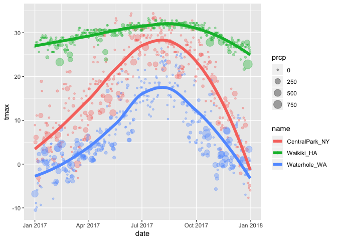

viz\_and\_eda
================

``` r
library(tidyverse)
```

    ## ── Attaching packages ──────────────── tidyverse 1.2.1 ──

    ## ✔ ggplot2 3.2.1     ✔ purrr   0.3.2
    ## ✔ tibble  2.1.3     ✔ dplyr   0.8.3
    ## ✔ tidyr   1.0.0     ✔ stringr 1.4.0
    ## ✔ readr   1.3.1     ✔ forcats 0.4.0

    ## ── Conflicts ─────────────────── tidyverse_conflicts() ──
    ## ✖ dplyr::filter() masks stats::filter()
    ## ✖ dplyr::lag()    masks stats::lag()

``` r
library(ggridges)
```

    ## 
    ## Attaching package: 'ggridges'

    ## The following object is masked from 'package:ggplot2':
    ## 
    ##     scale_discrete_manual

## create the weather data

``` r
weather_df = 
  rnoaa::meteo_pull_monitors(c("USW00094728", "USC00519397", "USS0023B17S"),
                      var = c("PRCP", "TMIN", "TMAX"), 
                      date_min = "2017-01-01",
                      date_max = "2017-12-31") %>%
  mutate(
    name = recode(id, USW00094728 = "CentralPark_NY", 
                      USC00519397 = "Waikiki_HA",
                      USS0023B17S = "Waterhole_WA"),
    tmin = tmin / 10,
    tmax = tmax / 10) %>%
  select(name, id, everything())
```

    ## Registered S3 method overwritten by 'crul':
    ##   method                 from
    ##   as.character.form_file httr

    ## Registered S3 method overwritten by 'hoardr':
    ##   method           from
    ##   print.cache_info httr

    ## file path:          /Users/troylayouni/Library/Caches/rnoaa/ghcnd/USW00094728.dly

    ## file last updated:  2019-09-26 10:27:17

    ## file min/max dates: 1869-01-01 / 2019-09-30

    ## file path:          /Users/troylayouni/Library/Caches/rnoaa/ghcnd/USC00519397.dly

    ## file last updated:  2019-09-26 10:27:29

    ## file min/max dates: 1965-01-01 / 2019-09-30

    ## file path:          /Users/troylayouni/Library/Caches/rnoaa/ghcnd/USS0023B17S.dly

    ## file last updated:  2019-09-26 10:27:33

    ## file min/max dates: 1999-09-01 / 2019-09-30

## create a ggplot

``` r
ggplot(weather_df, aes(x = tmin, y = tmax)) + 
  geom_point()
```

    ## Warning: Removed 15 rows containing missing values (geom_point).

<!-- -->

alternate way of amking this plot

``` r
weather_df %>% 
  ggplot(aes(x = tmin, y = tmax)) +
  geom_point()
```

    ## Warning: Removed 15 rows containing missing values (geom_point).

<!-- -->

saving initial plots: this is not used most of the time

``` r
scatterplot =     #creating a plot to save called scatterplot
  weather_df %>% 
  ggplot(aes(x = tmin, y = tmax)) +
  geom_point()

scatterplot       #show plot
```

    ## Warning: Removed 15 rows containing missing values (geom_point).

<!-- -->

adding color…

``` r
weather_df %>% 
  ggplot(aes(x = tmin, y = tmax)) +
  geom_point(aes(color = name), alpha = .4)
```

    ## Warning: Removed 15 rows containing missing values (geom_point).

<!-- -->

why does ‘aes’ position matter?

``` r
weather_df %>% 
  ggplot(aes(x = tmin, y = tmax)) +
  geom_point(aes(color = name), alpha = .4) + 
  geom_smooth(se = FALSE)       #se = false takes away the error around line
```

    ## `geom_smooth()` using method = 'gam' and formula 'y ~ s(x, bs = "cs")'

    ## Warning: Removed 15 rows containing non-finite values (stat_smooth).

    ## Warning: Removed 15 rows containing missing values (geom_point).

<!-- -->

``` r
weather_df %>% 
  ggplot(aes(x = tmin, y = tmax, color = name)) +
  geom_point(aes(alpha = .4)) + 
  geom_smooth(se = FALSE)
```

    ## `geom_smooth()` using method = 'loess' and formula 'y ~ x'

    ## Warning: Removed 15 rows containing non-finite values (stat_smooth).

    ## Warning: Removed 15 rows containing missing values (geom_point).

<!-- -->

color applied in ggplot aes= will apply the color to everything that
follows where as if it is applie in a later step it is only applied o
that part (like geom\_point it will only apply to the points not the
line in geom smooth)

``` r
weather_df %>% 
  ggplot(aes(x = tmin, y = tmax, color = name)) +
  geom_point(aes(alpha = .4)) + #alpha creates a more transparent point
  geom_smooth(se = FALSE) +
  facet_grid(~name) #this creates a plot for each category of the variable "name"
```

    ## `geom_smooth()` using method = 'loess' and formula 'y ~ x'

    ## Warning: Removed 15 rows containing non-finite values (stat_smooth).

    ## Warning: Removed 15 rows containing missing values (geom_point).

<!-- -->

``` r
weather_df %>% 
  ggplot(aes(x = date, y = tmax, color = name)) + 
  geom_point() +
  geom_smooth(se = FALSE)
```

    ## `geom_smooth()` using method = 'loess' and formula 'y ~ x'

    ## Warning: Removed 3 rows containing non-finite values (stat_smooth).

    ## Warning: Removed 3 rows containing missing values (geom_point).

<!-- -->

``` r
weather_df %>% 
  ggplot(aes(x = date, y = tmax, color = name)) + 
  geom_point(aes(size = prcp), alpha = .35) + # size makes point relative to amount of precipitation
  geom_smooth(size = 2, se = FALSE) #size in smooth vommmsnf line refers to width of line? 
```

    ## `geom_smooth()` using method = 'loess' and formula 'y ~ x'

    ## Warning: Removed 3 rows containing non-finite values (stat_smooth).

    ## Warning: Removed 3 rows containing missing values (geom_point).

<!-- -->

## some extra stuff

``` r
weather_df %>% 
  ggplot(aes(x = date, y = tmax, color = name)) + 
  geom_smooth(size = 2, se = FALSE) # no geom_point creates just smooth curve- dont do this 
```

    ## `geom_smooth()` using method = 'loess' and formula 'y ~ x'

    ## Warning: Removed 3 rows containing non-finite values (stat_smooth).

<!-- -->

2d density

``` r
weather_df %>% 
  ggplot(aes(x = tmin, y = tmax)) +
  geom_bin2d()
```

    ## Warning: Removed 15 rows containing non-finite values (stat_bin2d).

<!-- -->

## more kinds of plots

``` r
weather_df %>% 
  ggplot(aes(x = tmax, fill = name)) +
  geom_histogram() + #(position = "dodge") will dictate how to overlap the data for different places 
  facet_grid(~name)
```

    ## `stat_bin()` using `bins = 30`. Pick better value with `binwidth`.

    ## Warning: Removed 3 rows containing non-finite values (stat_bin).

<!-- -->

density plots

``` r
weather_df %>% 
  ggplot(aes(x = tmax, fill = name)) +
  geom_density(alpha = .3)
```

    ## Warning: Removed 3 rows containing non-finite values (stat_density).

<!-- -->

box plots

``` r
weather_df %>% 
  ggplot(aes(x = name, y = tmax)) + 
  geom_boxplot()
```

    ## Warning: Removed 3 rows containing non-finite values (stat_boxplot).

<!-- -->

violin plot

``` r
weather_df %>% 
  ggplot(aes(x = name, y = tmax)) + 
  geom_violin() #only good thing: can see bimodality and you cant in a boxplot 
```

    ## Warning: Removed 3 rows containing non-finite values (stat_ydensity).

<!-- -->

ridge plots

``` r
weather_df %>% 
  ggplot(aes(x = tmax, y = name)) + 
  geom_density_ridges() #can see bimodality 
```

    ## Picking joint bandwidth of 1.84

    ## Warning: Removed 3 rows containing non-finite values (stat_density_ridges).

<!-- -->

## saving a plot

``` r
ggp_ridges_temp = 
  weather_df %>% 
  ggplot(aes(x = tmax, y = name)) + 
  geom_density_ridges()

ggsave("ggplot_temp_ridge.pdf", ggp_ridges_temp)
```

    ## Saving 7 x 5 in image

    ## Picking joint bandwidth of 1.84

    ## Warning: Removed 3 rows containing non-finite values (stat_density_ridges).

``` r
weather_df %>% 
  ggplot(aes(x = tmin, y = tmax, color = name)) +
  geom_point(aes(alpha = .4)) + 
  geom_smooth(se = FALSE) 
```

    ## `geom_smooth()` using method = 'loess' and formula 'y ~ x'

    ## Warning: Removed 15 rows containing non-finite values (stat_smooth).

    ## Warning: Removed 15 rows containing missing values (geom_point).

<!-- -->

``` r
weather_df %>% 
  ggplot(aes(x = tmin, y = tmax, color = name)) +
  geom_point(aes(alpha = .4)) + 
  geom_smooth(se = FALSE) 
```

    ## `geom_smooth()` using method = 'loess' and formula 'y ~ x'

    ## Warning: Removed 15 rows containing non-finite values (stat_smooth).

    ## Warning: Removed 15 rows containing missing values (geom_point).

<!-- -->
