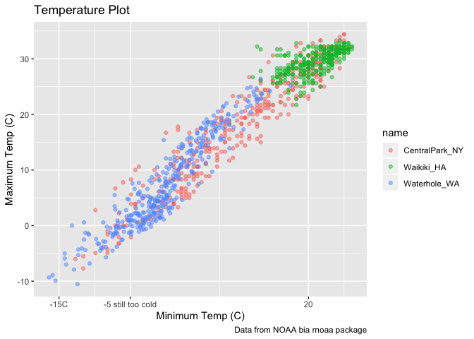
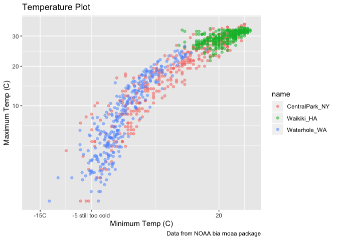
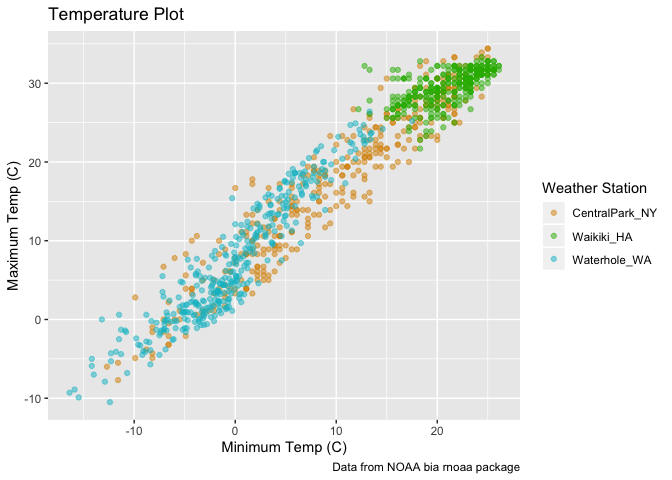
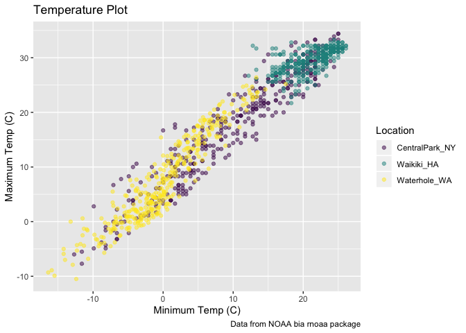
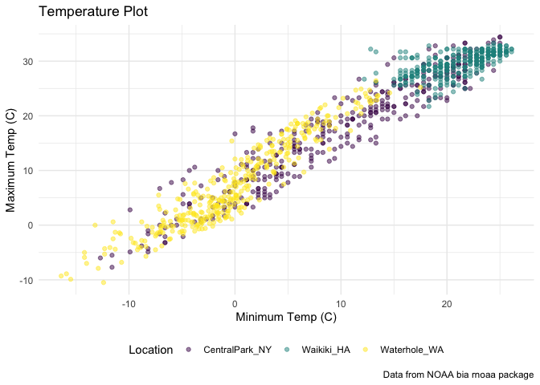

ggplot2
================

``` r
library(tidyverse)
```

    ## ── Attaching packages ────────────────────────────── tidyverse 1.2.1 ──

    ## ✔ ggplot2 3.2.1     ✔ purrr   0.3.2
    ## ✔ tibble  2.1.3     ✔ dplyr   0.8.3
    ## ✔ tidyr   1.0.0     ✔ stringr 1.4.0
    ## ✔ readr   1.3.1     ✔ forcats 0.4.0

    ## ── Conflicts ───────────────────────────────── tidyverse_conflicts() ──
    ## ✖ dplyr::filter() masks stats::filter()
    ## ✖ dplyr::lag()    masks stats::lag()

``` r
library(ggridges)
```

    ## 
    ## Attaching package: 'ggridges'

    ## The following object is masked from 'package:ggplot2':
    ## 
    ##     scale_discrete_manual

## create the weather data

``` r
#cacheing will prevent loading from the server each time- saves to directory 
weather_df = 
  rnoaa::meteo_pull_monitors(c("USW00094728", "USC00519397", "USS0023B17S"),
                      var = c("PRCP", "TMIN", "TMAX"), 
                      date_min = "2017-01-01",
                      date_max = "2017-12-31") %>%
  mutate(
    name = recode(id, USW00094728 = "CentralPark_NY", 
                      USC00519397 = "Waikiki_HA",
                      USS0023B17S = "Waterhole_WA"),
    tmin = tmin / 10,
    tmax = tmax / 10) %>%
  select(name, id, everything())
```

    ## Registered S3 method overwritten by 'crul':
    ##   method                 from
    ##   as.character.form_file httr

    ## Registered S3 method overwritten by 'hoardr':
    ##   method           from
    ##   print.cache_info httr

    ## file path:          /Users/troylayouni/Library/Caches/rnoaa/ghcnd/USW00094728.dly

    ## file last updated:  2019-09-26 10:27:17

    ## file min/max dates: 1869-01-01 / 2019-09-30

    ## file path:          /Users/troylayouni/Library/Caches/rnoaa/ghcnd/USC00519397.dly

    ## file last updated:  2019-09-26 10:27:29

    ## file min/max dates: 1965-01-01 / 2019-09-30

    ## file path:          /Users/troylayouni/Library/Caches/rnoaa/ghcnd/USS0023B17S.dly

    ## file last updated:  2019-09-26 10:27:33

    ## file min/max dates: 1999-09-01 / 2019-09-30

start with an old plot

``` r
weather_df %>% 
  ggplot(aes(x = tmin, y = tmax)) + 
  geom_point(aes(color = name), alpha = .5)
```

    ## Warning: Removed 15 rows containing missing values (geom_point).

<!-- -->

adding labels

``` r
weather_df %>% 
  ggplot(aes(x = tmin, y = tmax)) + 
  geom_point(aes(color = name), alpha = .5) +
  labs(
    title = "Temperature Plot",
    x = "Minimum Temp (C)",
    y = "Maximum Temp (C)",
    caption = "Data from NOAA bia rnoaa package"
  )
```

    ## Warning: Removed 15 rows containing missing values (geom_point).

<!-- -->

x axis tick marks etc.

``` r
weather_df %>% 
  ggplot(aes(x = tmin, y = tmax)) + 
  geom_point(aes(color = name), alpha = .5) +
  labs(
    title = "Temperature Plot",
    x = "Minimum Temp (C)",
    y = "Maximum Temp (C)",
    caption = "Data from NOAA bia rnoaa package"
  ) + 
  scale_x_continuous(
    breaks = c(-15, -5, 20),
    labels = c("-15C", "-5 still too cold", "20")
  )
```

    ## Warning: Removed 15 rows containing missing values (geom_point).

<!-- -->

scale options

``` r
weather_df %>% 
  ggplot(aes(x = tmin, y = tmax)) + 
  geom_point(aes(color = name), alpha = .5) +
  labs(
    title = "Temperature Plot",
    x = "Minimum Temp (C)",
    y = "Maximum Temp (C)",
    caption = "Data from NOAA bia rnoaa package"
  ) + 
  scale_x_continuous(
    breaks = c(-15, -5, 20),
    labels = c("-15C", "-5 still too cold", "20")
  ) + 
  scale_y_continuous( 
    trans = "sqrt"  #transforming 
  )
```

    ## Warning in self$trans$transform(x): NaNs produced

    ## Warning: Transformation introduced infinite values in continuous y-axis

    ## Warning: Removed 90 rows containing missing values (geom_point).

<!-- -->

colors\!

``` r
weather_df %>% 
  ggplot(aes(x = tmin, y = tmax)) + 
  geom_point(aes(color = name), alpha = .5) +
  labs(
    title = "Temperature Plot",
    x = "Minimum Temp (C)",
    y = "Maximum Temp (C)",
    caption = "Data from NOAA bia rnoaa package"
  ) + 
  scale_color_hue(
    name = "Weather Station", #giving legend a more descriptive title 
    h = c(50, 200)
  )
```

    ## Warning: Removed 15 rows containing missing values (geom_point).

<!-- -->

``` r
ggp_base = 
weather_df %>% 
  ggplot(aes(x = tmin, y = tmax)) + 
  geom_point(aes(color = name), alpha = .5) +
  labs(
    title = "Temperature Plot",
    x = "Minimum Temp (C)",
    y = "Maximum Temp (C)",
    caption = "Data from NOAA bia rnoaa package"
  ) + 
  viridis::scale_color_viridis(
    name = "Location", 
    discrete = TRUE
  )

ggp_base
```

    ## Warning: Removed 15 rows containing missing values (geom_point).

<!-- -->

### Themes

  - theme: order matters\!

<!-- end list -->

``` r
ggp_base +
  theme_minimal() +
  theme(legend.position = "bottom")
```

    ## Warning: Removed 15 rows containing missing values (geom_point).

<!-- -->

Setting options - check class notes
